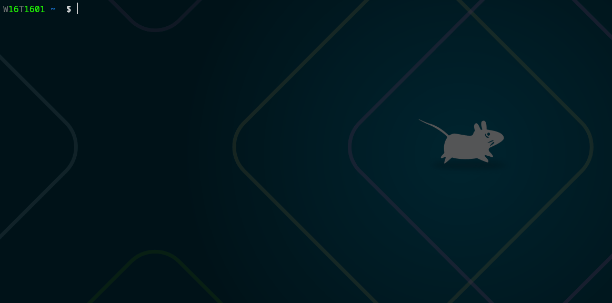

---

# CoinMaster

  
*Demonstration of adding a transaction (basic CLI form interface)*

A simple personal finance tracker using TaskWarrior as its backbone.

---

## Naming  
The name combines:  
1. **"Coin"** - Explicit financial focus (transactions over tasks)  
2. **"Master"** - From *A Song of Ice and Fire*'s "Master of Coin" role  
3. **"TaskWarrior"** - Direct inspiration for the CLI paradigm  

## Current State

CoinMaster is a minimal interface for financial tracking via TaskWarrior:

  - Data Model: Directly mirrors TaskWarrior's JSON schema for compatibility
  - Interaction: Crude form-based wrapper around task import for transaction entry
  - Basic CRUD operations (no advanced validation or workflows)
  - No financial logic (balances, reports, or analytics)

This serves strictly as a proof-of-concept for TaskWarrior-as-a-ledger 
